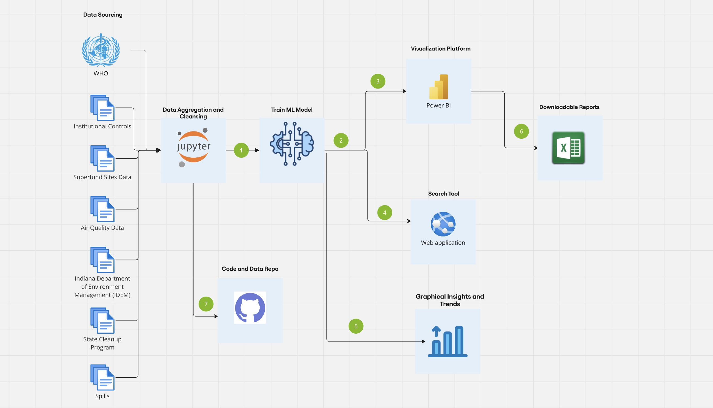

# Indiana Toxicity Watch: Mapping Health & Environmental Risks

[View the Tool!](https://jimmy-johns.onrender.com/)

## Project Overview

The Indiana Toxicity Watch platform is designed to empower citizens, policymakers, and researchers by providing a comprehensive, accessible, and interactive tool to monitor toxic chemicals, their geolocation, and the associated health risks in Indiana. This project integrates multiple data sources, offering visualizations, health risk analysis, and a web-based search tool to track environmental risks and enable informed decisions.

## Objective

The platform aggregates publicly available data on toxic chemicals, correlates them with health outcomes, and provides users with the ability to search, visualize, and analyze environmental risks in Indiana. The tool is intended to help users understand the potential health impacts of toxic exposure and make decisions based on location-based data.

## Key Features

- **Data Aggregation & Cleansing**: Integrated data from various public sources, cleaned and standardized for ease of use.
- **Visualization Dashboard**: An interactive map that allows users to filter by chemical, health outcomes, and location proximity to important areas like schools, hospitals, and residential zones.
- **Health Risk Analysis**: A risk analysis model that correlates toxic chemicals with health outcomes like cancer, respiratory diseases, and other health issues.
- **Web-Based Search Tool**: Users can search by zip code, address, or area of interest to instantly view contamination risks and health data.
- **Data Insights and Reporting**: Visualize trends over time, with downloadable reports to assist advocacy for environmental policy changes.

## Technologies Used

- Backend: Python, Flask (for the web-based search tool)
- Frontend: JavaScript, HTML/CSS, Nivo, React
- Data Storage: CSV Files
- Visualization: PowerBI, Matplotlib
- Data Processing: Pandas, NumPy, Scikit-Learn

## Installation

To run this project locally, follow these steps:

1. Clone the Repository:
```bash
git clone https://github.com/yourusername/indiana-toxicity-watch.git
cd indiana-toxicity-watch
```

2. Install Dependencies:
```bash
pip install -r requirements.txt
```

3. Set Up the Database:
   Ensure your database is set up with the appropriate schema and import the necessary datasets.

4. Run the Web Application:
```bash
python app.py
```
   Visit http://localhost:5000 in your web browser to access the platform.

## Usage

- **Interactive Dashboard**: Navigate to the dashboard to explore a comprehensive map of toxic chemicals in Indiana. Use filters to visualize data by chemical, health outcome, or location.
- **Web-Based Search Tool**: Enter a zip code, address, or area of interest to quickly view contamination data and health risks associated with that region.
- **Health Risk Analysis**: Review the risk analysis and download reports showing correlations between toxic chemicals and health outcomes.

## Datasets
### State Cleanup Data
This dataset contains information about chemical spills across various counties in Indiana, providing details on the location and nature of each spill.
Dataset Link: https://www.in.gov/idem/cleanups/investigation-and-cleanup-programs/state-cleanup-program/

### Toxic Releases Dataset
This dataset is used to analyze toxic chemical releases and their potential impact on health outcomes, helping to identify areas of concern related to environmental health.
Dataset Link: https://enviro.epa.gov/triexplorer/tri_factsheet.factsheet_forstate?pYear=2022&pstate=IN&pParent=NAT

### Institutional Controls
This dataset is used for geolocation tagging, providing information to accurately map and track environmental and health-related data based on geographic locations.
Dataset Link: https://www.in.gov/idem/cleanups/investigation-and-cleanup-programs/institutional-controls/

### Indiana Zip Codes
This dataset contains zip code information for Indiana, used to create accurate geographic maps.
Dataset Link: https://www.stats.indiana.edu/maptools/county_zips.xls

### Superfund Sites Data
This dataset provides details about the U.S. EPA's Superfund program, focusing on contaminated lands being cleaned up for safe use. It includes information on site locations, contamination levels, and cleanup status.
Dataset Link: https://www.epa.gov/superfund/search-superfund-sites-where-you-live

### Spills Data
This dataset contains details of chemical spills across various counties in Indiana.
Dataset Link: https://www.in.gov/idem/cleanups/investigation-and-cleanup-programs/emergency-response/

### Quality of Life and Premature Death Statistics
This dataset provides comprehensive insights into the quality of life and premature death rates for each county. Quality of life is represented through state rankings, highlighting where each county stands. Premature death statistics are detailed by actual death counts and years of potential life lost (YPLL), offering a nuanced understanding of mortality impacts.
Dataset Link: https://www.countyhealthrankings.org/health-data/indiana/data-and-resources

### Tuberculosis Dataset
Sourced from the World Health Organization (WHO), this dataset records the incidence of tuberculosis globally over several years. It enables an analysis of TB trends, geographical distributions, and the burden of the disease across different regions and timeframes.
Dataset Link: https://www.who.int/data/#collection

### Air Quality Dataset
Curated by the World Health Organization (WHO), this dataset contains statistics on air pollutants from various countries worldwide. It provides a detailed look at pollution levels, enabling cross-country comparisons and facilitating research on air quality's impact on health and the environment.
Dataset Link: https://www.who.int/data/#collection

### Solution Architecture
This architecture outlines the data flow from multiple sources through aggregation, cleansing, and machine learning processing. The insights are visualized using Power BI, accessible via a web application, and available as downloadable reports, with code and data managed in GitHub.



## Contributors

- Suhaas Rao Badada
- Abhay Singh
- Shubham Kumar
- Murun Tsogtkhuyag